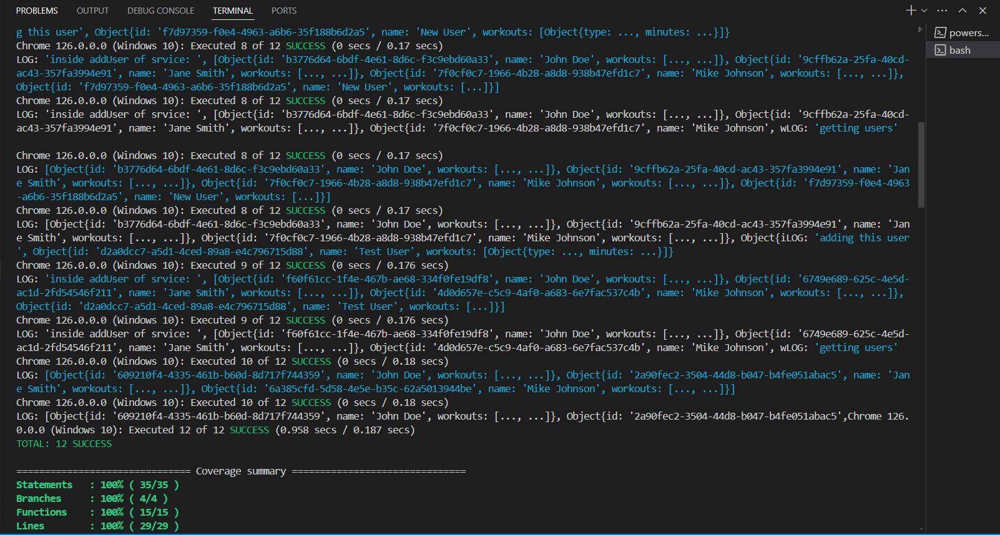

# Workout Challenge Tracker

## Overview

Workout Challenge Tracker is a Single Page Application (SPA) built with Angular to manage users and their workouts. The application allows adding, editing, and deleting users along with their workout details, and visualizes the workout data using charts.

## Features

- Add new users with workout details
- Edit existing users and their workout details
- Delete users
- Filter users by name and workout type
- View workout details in a tabular format
- Visualize workout data using charts

## Technology Stack

- Angular
- Tailwind CSS
- PrimeNG for charts

## Getting Started

### Prerequisites

- Node.js and npm installed on your machine

### Installation

1. Clone the repository and navigate into it.
2. Install the project dependencies.

### Running the Application

1. Start the development server.
2. Open your browser and navigate to `http://localhost:4200/`.

### Running Tests

To run the tests and generate a code coverage report:

1. Execute the test command with code coverage flag.
2. The tests will run, and a code coverage report will be generated in the `coverage/` directory.

### Viewing the Code Coverage Report

1. Navigate to the `coverage/` directory after running the tests.
2. Open the `index.html` file in a web browser to view the coverage report.

## Unit Tests

The assignment includes unit tests for one service (`UserService`) and one component (`HeaderComponent`) with 100% code coverage.

### UserService Tests

- Test for service creation.
- Test for adding a new user.
- Test for updating an existing user.
- Test for deleting a user.
- Test for filtering users by name.
- Test for filtering users by workout type.

### HeaderComponent Tests

- Test for component creation.
- Test for header title rendering.

## Code Coverage

## Conclusion

This project provides a comprehensive solution for tracking workouts, managing user data, and visualizing workout information in a user-friendly manner. With unit tests ensuring robust functionality, the Workout Challenge Tracker is a reliable tool for fitness enthusiasts and trainers alike.
